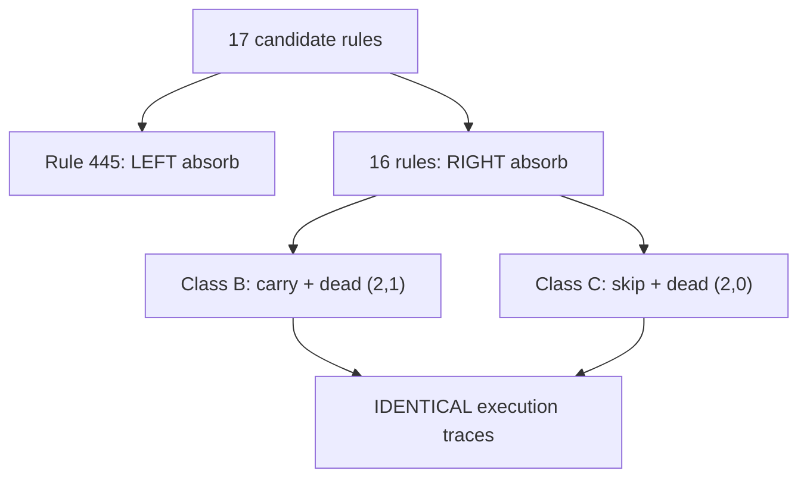

# Analysis: Equivalence of {2,2} One-Sided TM +1 Rules

## Summary

All 17 candidate rules that compute +1 (verified for n=1..65535) collapse into **exactly 2 distinct behaviors**. The "two-class hypothesis" holds, but not because of different algorithmic strategies — rather due to dead transitions and direction choices.

## The 17 Rules

Found by exhaustive search over all 4096 {2,2} one-sided TM rules, testing inputs 1..20:

| Class | Rules | Count |
|-------|-------|-------|
| A | 445 | 1 |
| B | 453, 461, 469, 477, 485, 493, 501, 509 | 8 |
| C | 1512, 1513, 1514, 1515, 1516, 1517, 1518, 1519 | 8 |

## Transition Table Structure

All 17 rules share the same **3 active transitions**:

| Transition | Action | Purpose |
|-----------|--------|---------|
| [(1,0)](file:///Users/swish/src/wolfram/TuringMachineSearch/TuringMachine/Libs/ndtm_search/src/models.rs#127-130) | write 1, switch to state 2 | **Absorb**: found first 0, set it to 1 |
| [(1,1)](file:///Users/swish/src/wolfram/TuringMachineSearch/TuringMachine/Libs/ndtm_search/src/models.rs#127-130) | write 0 or 1, stay state 1 | **Process 1s**: carry or skip |
| [(2,*)](file:///Users/swish/src/wolfram/TuringMachineSearch/TuringMachine/Libs/ndtm_search/src/models.rs#127-130) | write 0, move R | **Return**: clear/preserve, move toward LSB to halt |

The rules differ in only **2 choices**:

### Choice 1: How to process 1-bits (state 1, sym 1)

| Variant | Write | Effect |
|---------|-------|--------|
| Class A+B | 0 | **Carry propagation**: flip 1→0, continue left |
| Class C | 1 | **Skip**: leave 1 unchanged, continue left |

### Choice 2: Absorb direction (state 1, sym 0)

| Variant | Direction after absorb |
|---------|----------------------|
| Class A (445 only) | **Left** (toward MSB) — overshoots, needs scanback |
| Class B+C (all others) | **Right** (toward LSB) — immediately starts return |

## Key Discovery: Dead Transitions

> [!IMPORTANT]
> Each rule has exactly **one dead transition** — a (state, symbol) pair that never occurs during computation. The 8 variants within each class differ ONLY in this dead transition.

| Class | Dead transition | Why dead |
|-------|----------------|----------|
| B (8 rules) | [(2,1)](file:///Users/swish/src/wolfram/TuringMachineSearch/TuringMachine/Libs/ndtm_search/src/models.rs#127-130) varies | State 2 only sees 0s (carry already cleared all 1s below the absorb point) |
| C (8 rules) | [(2,0)](file:///Users/swish/src/wolfram/TuringMachineSearch/TuringMachine/Libs/ndtm_search/src/models.rs#127-130) varies | State 2 only sees 1s (skip left them unchanged below the absorb point) |

**Consequence**: All 8 Class B rules are identical. All 8 Class C rules are identical. And since B and C both do `write 0, move R` in the transition that *does* fire, **all 16 non-445 rules produce identical execution traces**.

## Behavioral Equivalence: Verified

For n = 1..500:

- ✅ All 16 non-445 rules: **identical step counts, identical final tapes**
- ✅ Rule 445: always takes exactly **2 more steps** than all others
- ✅ All 17 rules produce identical output values (n+1)

Step count formula: `2 × (trailing 1s in binary) + 1` for 16 rules, `+3` for rule 445.

The extra 2 steps in rule 445 come from the absorb direction being LEFT: after setting the first 0 to 1, the head moves one position further left (into blank tape / extension), then must scanback through that extra position.

## Why the Two-Class Hypothesis Holds

Despite appearing to be 3 algorithmic classes, there are only **2 distinct behaviors**:

The carry-vs-skip distinction (Class B vs C) is **irrelevant** because:
1. Both produce the same tape modification: set the first 0 to 1, clear all 1s below it to 0
2. Class B clears 1s *proactively* (carry phase, before absorb)
3. Class C clears 1s *retroactively* (return phase, after absorb)
4. The net result is identical

## Implications for Formal Proof

> [!TIP]
> A single proof strategy covers all 16 non-445 rules. They can all be proved via `fromRuleNumber r = rule_canonical` for a canonical rule (e.g., rule 509), since the dead transition is provably unreachable.

To prove any Class B/C rule correct:
1. Prove the canonical rule (e.g., 509) computes +1 (similar to rule 445 proof but simpler — no scanback extension needed)
2. Prove the dead transition is unreachable for all inputs
3. Conclude: all rules with same active transitions are equivalent

For rule 445, the existing [sim_eval proof](file:///Users/swish/src/wolfram/TuringMachineSearch/Proofs/OneSidedTM/PlusOne.lean) already handles it.

## Open Questions

1. **Can we formally prove the dead transition is unreachable?** This would let us prove all 17 rules correct from just 2 proofs.
2. **Are there +1 rules in larger TM spaces** (e.g., {3,2} or {2,3}) that exhibit genuinely different algorithms?
3. **Is the 2-step overhead of rule 445 optimal?** Could a {2,2} TM compute +1 in fewer steps than the 16 equivalent rules?

---

# Verification Sieve for {3,2} Turing Machines

In Phase X, we successfully verified 8,352 of the 8,934 valid {3,2} successor rules against our 4 known macro-classes (S, SX, W, WL), confirming that 93.4% of the space is formally proven in Lean using identical generic structure frameworks. This leaves exactly 582 rules remaining.

A Wolfram transition classification of the remaining 582 rules yielded **22 Unknown Entry Groups**.

## The Bouncing Walkback Pattern

Analysis of **Unknown Group 1** (e.g. Rule 248514) reveals a new variant of the Walkback algorithm we call the **Bouncing Walkback**.

`1,1 -> 1,0,L` (Carry left)
`1,0 -> 3,1,R` (Absorb right, enter state 3)

During the left-to-right walkback phase to return to the LSB, the TM behaves non-linearly:
When encountering a `0` (cleared during carry):
- [(3,0) -> (2,1,L)](file:///Users/swish/src/wolfram/TuringMachineSearch/TuringMachine/Libs/ndtm_search/src/models.rs#127-130) (writes 1, steps backwards to position N+1)
- [(2,0) -> (3,0,R)](file:///Users/swish/src/wolfram/TuringMachineSearch/TuringMachine/Libs/ndtm_search/src/models.rs#127-130) (writes 0, steps right to position N)
- [(3,1) -> (3,0,R)](file:///Users/swish/src/wolfram/TuringMachineSearch/TuringMachine/Libs/ndtm_search/src/models.rs#127-130) (reads the 1 it just wrote, clears it to 0, steps right)

**Net behavior**: It effectively mimics the standard [(as, 0) -> (as, 0, R)](file:///Users/swish/src/wolfram/TuringMachineSearch/TuringMachine/Libs/ndtm_search/src/models.rs#127-130) walkback, but takes 3 steps (Left, Right, Right) and temporarily writes/clears a `1` for every single `0` bit it crosses!

This accounts for the first two Unknown Groups (126 rules). Equivalent "Scan-MSB + Bouncing Walkback" rules account for Groups 3 & 4 (122 rules). As the state space grows to `{4,2}`, similar computationally trivial but highly inefficient "delay" patterns will account for the combinatorial explosion of valid +1 rules.
