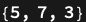
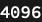
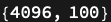
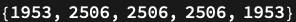
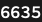
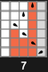
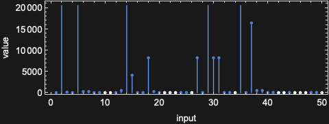
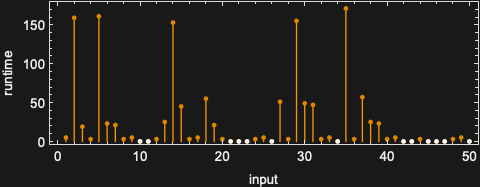

# TuringMachine

A Wolfram Language paclet for exploring and analyzing Turing machines, powered by a Rust backend for high-performance enumeration and search.

📦 **Paclet Repository:** <https://resources.wolframcloud.com/PacletRepository/resources/WolframInstitute/TuringMachine/>

> The published [`README.md`](README.md) is generated from [`README-raw.md`](README-raw.md) with [MarkdownToNotebook](https://resources.wolframcloud.com/FunctionRepository/resources/MarkdownToNotebook/); its output images are live evaluations. Edit `README-raw.md` and regenerate — don't edit `README.md` by hand.

## Installation

```wolfram
PacletInstall["WolframInstitute/TuringMachine"]
Needs["WolframInstitute`TuringMachine`"]
```

## Documentation

Full documentation — a guide page, a reference page for every symbol, and a tutorial — ships with the paclet and is browsable on the [Paclet Repository page](https://resources.wolframcloud.com/PacletRepository/resources/WolframInstitute/TuringMachine/). The markdown sources live under [`TuringMachine/docs/`](TuringMachine/docs) and are built into the paclet's documentation notebooks by [`scripts/build_docs.wls`](scripts/build_docs.wls).

## Usage

A machine is identified by its Wolfram enumeration number together with its state and color counts, written `{number, s, k}`. A bare integer is shorthand for a 2-state, 2-color machine.

### Deterministic (one-sided) machines

Run the *s*=3, *k*=2 rule 600720 on input 1 for at most 32 steps:

```wolfram
OneSidedTuringMachineFunction[{600720, 3, 2}, 1, 32]
```


Return the steps, value, and width together as `{steps, value, width}`:

```wolfram
OneSidedTuringMachineFunction[{600720, 3, 2}, 1, 32, All]
```



A bare integer rule is treated as a 2-state, 2-color machine:

```wolfram
OneSidedTuringMachineFunction[2506, 1, 100]
```


Give the transition table explicitly, as `{state, symbol} -> {nextState, writeSymbol, direction}` (direction `1` = right, `-1` = left):

```wolfram
OneSidedTuringMachineFunction[{{1, 0} -> {1, 1, 1}, {1, 1} -> {1, 0, -1}}, 1, 100]
```


### Tabulating whole rule spaces

Count the distinct rules with 2 states and 2 colors:

```wolfram
TuringMachineRuleCount[2, 2]
```



Tabulate step counts for all 4096 two-state, two-color machines over inputs 1 through 100 (backed by Rust):

```wolfram
Dimensions[TuringMachineSteps[2, 2, 200, 100]]
```



See also `TuringMachineOutput`, `TuringMachineWidths`, and the combined `TuringMachineOutputWithStepsWidths` (and their numeric `...Float` variants).

### Nondeterministic (multiway) machines

A multiway machine is a list of integer rule numbers; where their transitions disagree, the machine branches. Search for a sequence of transitions turning input 0 into output 5 within 50 steps:

```wolfram
MultiwayTuringMachineSearch[{2506, 1953}, 0, 5, 50]
```



Count how many branches remain unexplored after 20 steps:

```wolfram
MultiwayNonHaltedStatesLeft[{2506, 1953}, 0, 20]
```



### Cycle detection

Rule 257 enters a cycle within 1000 steps on input 1:

```wolfram
NonTerminatingTuringMachineQ[257, 1, 1000]
```


Rule 2506 does not:

```wolfram
NonTerminatingTuringMachineQ[2506, 1, 1000]
```


### Visualization

Plot the space-time evolution — tape cells colored by symbol, the head a black marker:

```wolfram
OneSidedTuringMachinePlot[{600720, 3, 2}, 1, 16]
```



Plot the output value as a function of the input:

```wolfram
OneSidedTuringMachineFunctionPlot[{600720, 3, 2}, {1, 50}, 200]
```



Plot the running time as a function of the input:

```wolfram
OneSidedTuringMachineRuntimePlot[{600720, 3, 2}, {1, 50}, 200]
```



## Building from source

The Rust backend (`TuringMachine/Libs/ndtm_search`) is built with
[`cargo wl`](https://crates.io/crates/cargo-wl), which compiles the library and writes it,
with its generated Wolfram Language loader, into
`TuringMachine/Binaries/ndtm_search-<SystemID>/`. The build scripts live in
[`scripts/`](scripts).

Build the library for the host and every cross target (macOS x86-64/ARM64, Linux
x86-64/ARM64, Windows x86-64). Cross-compiling needs the toolchains that
`scripts/setup_rust.sh` and `scripts/setup_cross_compile.sh` install; on a Mac it is easiest
to build inside the Wolfram Engine container with `scripts/docker_build.sh`:

```bash
./scripts/build_all_targets.sh
```

Load the paclet from this checkout:

```wolfram
PacletDirectoryLoad["TuringMachine"]
Needs["WolframInstitute`TuringMachine`"]
```

Rebuild the documentation notebooks and the Paclet Repository definition notebook
(`TuringMachine/ResourceDefinition.nb`) from their markdown sources:

```bash
wolframscript -f scripts/build_docs.wls
```

## Releasing

Bump `"Version"` in [`TuringMachine/PacletInfo.wl`](TuringMachine/PacletInfo.wl), rebuild the
docs, then submit to the Paclet Repository. The submitting account is read from a gitignored
`.env.publish` at the repository root (`WOLFRAM_CLOUD_USER=…`, `WOLFRAM_CLOUD_PASSWORD=…`) and
must own the `WolframInstitute` publisher:

```bash
wolframscript -f scripts/submit.wls --check   # lint the definition notebook only
wolframscript -f scripts/submit.wls           # PacletBuild into TuringMachine/build/ and submit
```

CI ([`.github/workflows/build_paclet.yml`](.github/workflows/build_paclet.yml)) builds all
targets and the paclet archive on every push to `main`; `scripts/act_run.sh` runs the same
workflow locally with [act](https://github.com/nektos/act).
